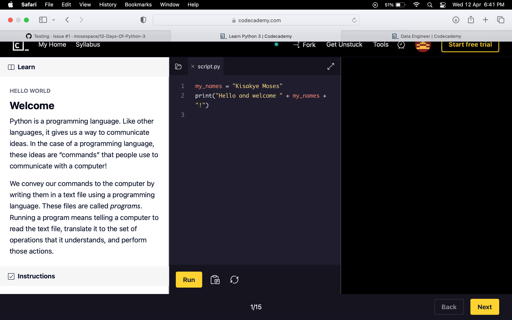

 <strong> 10-Days-Of-Python-3 This is a simple course followed on Codeacademy </strong> 

# Welcome

Python is a programming language. Like other languages, it gives us a way to communicate ideas. In the case of a programming language, these ideas are “commands” that people use to communicate with a computer!

We convey our commands to the computer by writing them in a text file using a programming language. These files are called programs. Running a program means telling a computer to read the text file, translate it to the set of operations that it understands, and perform those actions.

- [X] **Instructions**

Now since you have opened the file locally, Change `Kisakye Moses` to your name in the script to the right. Run the code to see what it does!

As soon as you’re ready, move on to the next exercise to begin learning to write your own Python programs!

- [X] **Concept Review**

Want to quickly review some of the concepts you’ve been learning? Take a look at this material' [cheatsheet](https://www.codecademy.com/learn/learn-python-3/modules/learn-python3-hello-world/cheatsheet)!

- [X] **Community Forums**

Here are some helpful links to the top questions asked by coders about this exercise:

        1. Why do I need to enter my name on a different line?

        2. How can I use an integer in a print function?

Still have questions? View this exercise's thread in the [Codecademy Forums](https://discuss.codecademy.com/t/371593?_gl=1*nil4w0*_ga*NDM3ODQ0NDk5LjE2ODEzMTEzNzc.*_ga_3LRZM6TM9L*MTY4MTMxMTQzMy4xLjEuMTY4MTMxMjY4OC40My4wLjA.).
